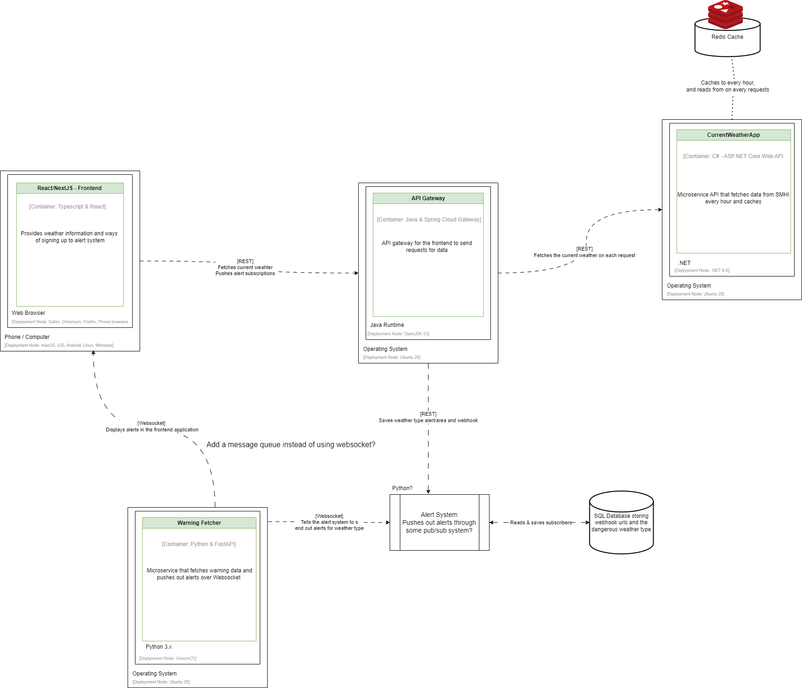

# Weather App

This project aims to integrate SMHI's alert and current weather API to extend the alert system to work with webhooks.

It also aims to provide current weather data through an interactive map.

## Requirements

- .NET 9.X
- Python 3.X

## How to run

I recommend developing using Docker Compose as it will orchestrate the different containers with little configuration.

To start work in development mode run the command:

```cmd
docker compose -f docker-compose.yaml -f docker-compose.development.yaml up
```

Another useful command for quickly tearing down all the containers in case something goes wrong is:

```cmd
docker compose down --rmi all
```

## Architecture (WIP)

The system is designed around microservices. The final pieces are not in place, but the data flow is not planned to change at this point.



## Finished parts

- ``CurrentWeatherApp`` is in a state where it can integrate with the other microservices at this point.
